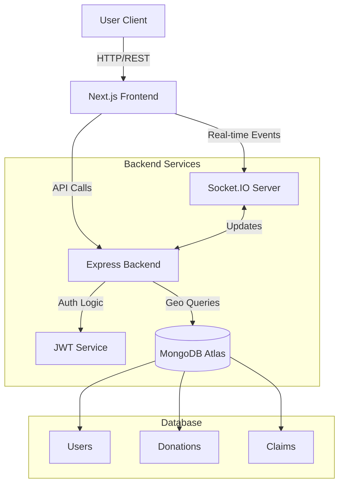

# 🌍 Waste-No-More
> *Bridging the gap between surplus food and those in need through hyper-local logistics.*


## 📖 Overview

**Waste-No-More** is a real-time logistics platform designed to combat food waste. It connects donors (restaurants, individuals) with surplus food to volunteers and receivers (shelters, NGOs) in their immediate vicinity.

Unlike static directories, this platform uses **Geospatial queries** and **WebSockets** to enable live coordination, ensuring food reaches those in need before it spoils.

---

## 🚀 Live Demo & Screenshots

**[🔗 View Live Demo](#)** *(Link your deployed app here)*

| Donor Dashboard | Volunteer Map |
|:---:|:---:|
|  |  |
| *Post donations in seconds* | *Real-time tracking of pickups* |

---

## ✨ Key Features

- **📍 Real-Time Geospatial Discovery**: Volunteers can see available donations on an interactive map within a specific radius (using MongoDB Geospatial queries).
- **⚡ Live Updates**: Socket.IO integration ensures that when a donation is claimed, it disappears from the map instantly for all other users.
- **🛡️ Role-Based Access Control (RBAC)**: Distinct dashboards and permissions for:
  - **Donors**: Post food, track history.
  - **Volunteers**: Find tasks, navigate to pickup/drop-off.
  - **Receivers**: Request food, manage inventory.
  - **Admins**: Oversee platform activity.
- **🔐 Secure Authentication**: JWT-based stateless authentication with encrypted passwords.

---

## 🛠️ System Architecture



---

## 💻 Tech Stack

### Frontend
- **Framework**: Next.js 14 (App Router)
- **Language**: TypeScript
- **Styling**: Tailwind CSS
- **State/Data**: React Query, Context API
- **Maps**: Google Maps API / Leaflet

### Backend
- **Runtime**: Node.js
- **Framework**: Express.js
- **Language**: TypeScript
- **Real-time**: Socket.IO
- **Database**: MongoDB (Mongoose ODM)

---

## 🚀 Getting Started

Follow these steps to set up the project locally.

### Prerequisites
- Node.js (v18+ recommended)
- MongoDB (Local or Atlas connection string)

### 1. Backend Setup
```bash
# Navigate to backend
cd backend

# Install dependencies
npm install

# Create .env file
cp .env.example .env

# Start the server
npm run dev
```

### 2. Frontend Setup
```bash
# Navigate to frontend
cd frontend

# Install dependencies
npm install

# Create .env.local file
cp .env.local.example .env.local

# Start the application
npm run dev
```

---

## 🔑 Environment Variables

**Backend (`backend/.env`)**
```env
PORT=5000
MONGODB_URI=mongodb://localhost:27017/waste-no-more
JWT_SECRET=your_super_secret_key_change_this
CLIENT_URL=http://localhost:3000
```

**Frontend (`frontend/.env.local`)**
```env
NEXT_PUBLIC_API_URL=http://localhost:5000/api
NEXT_PUBLIC_SOCKET_URL=http://localhost:5000
NEXT_PUBLIC_GOOGLE_MAPS_KEY=your_key_here
```

---

## 🧪 Demo Credentials (For Recruiters)

Use these accounts to test the different roles without registering:

| Role | Email | Password |
|------|-------|----------|
| **Donor** | `donor@demo.com` | `password123` |
| **Volunteer** | `volunteer@demo.com` | `password123` |
| **Receiver** | `receiver@demo.com` | `password123` |

*(Note: Ensure you run the seed script to create these users)*

---

## 🔮 Future Improvements
- [ ] **Push Notifications**: Notify volunteers when food is available nearby.
- [ ] **Route Optimization**: Suggest the best path for multiple pickups.
- [ ] **Image Recognition**: AI to auto-tag food items from photos.

---

## 👤 Author

**[Your Name]**
- 💼 [LinkedIn](https://linkedin.com/in/yourprofile)
- 🐙 [GitHub](https://github.com/yourusername)
- 📧 [Email](mailto:youremail@example.com)
# Waste-No-More
