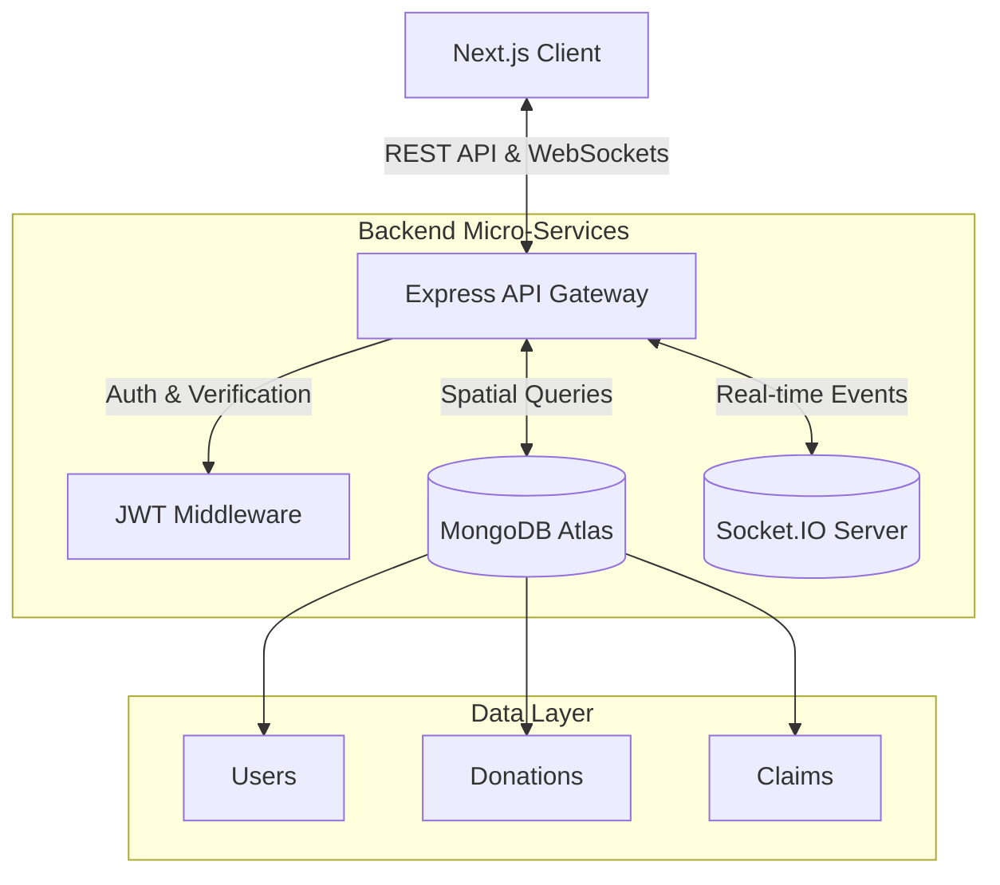

# 🌍 Waste-No-More: Real-Time Food Recovery Logistics

> *Engineering a scalable, real-time logistics platform to solve the $1 Trillion food waste problem.*


---

## 🚨 The Problem: Why Does Food Waste Exist?

**The Staggering Reality:** One-third of all food produced globally goes to waste, while millions face daily hunger. 

**The Root Cause (The Logistics Bottleneck):** The core issue isn't a lack of food—it is a **systemic logistics failure**. Traditional food banks and recovery networks rely on static directories, scheduled pickups, and manual phone-tree coordination. 

When a restaurant or bakery has highly perishable surplus food at 10:00 PM, traditional logistics are simply too slow. By the time a pickup can be manually scheduled for the next day, the food has spoiled and is thrown away.

## 💡 The Solution: Waste-No-More

Waste-No-More isn't just a static directory; it is a **hyper-local, real-time logistics engine**. 

By treating food recovery as an on-demand routing problem (similar to ride-sharing algorithms), the platform instantly connects surplus food with the nearest available volunteers. It eliminates the communication bottleneck, allowing perfectly good food to be recovered in minutes, not days.

---

## 🧠 How I Solved It: System Architecture & Engineering

To solve this logistics bottleneck, I designed and engineered a full-stack system focused strictly on **speed, geospatial awareness, and real-time concurrency.**

### 1. High-Performance Spatial Discovery
* **The Challenge:** Finding the closest volunteers to a newly posted donation without running expensive distance calculations against every user in the database.
* **The Engineering Solution:** I utilized **MongoDB's `2dsphere` spatial indexing**. When a donor posts food, the backend executes a highly optimized `$near` query. This filters and returns only active volunteers within a dynamic geographic radius, reducing query time complexity from O(N) to logarithmic complexity.

### 2. Concurrency & Real-Time State Sync
* **The Challenge:** Preventing "double-booking" (race conditions) where two volunteers attempt to claim the exact same food donation at the same millisecond.
* **The Engineering Solution:** I implemented an event-driven architecture using **Socket.io**. When a donation is claimed, the database locks the transaction. Instantly, the WebSocket server broadcasts a state-update event to all connected clients, seamlessly removing that donation marker from everyone else's live map without requiring a page refresh.

### 3. Role-Based Access Control (RBAC)
* **The Implementation:** A robust JWT-based stateless authentication system that securely routes users into distinct flows:
  * **Donors:** Fast-path inventory posting and analytics.
  * **Volunteers:** Geospatial task discovery and routing.
  * **Receivers:** Inventory request and management.

---

## 🛠️ System Architecture


```mermaid
graph TD
    Client[Next.js Client] <-->|REST API & WebSockets| API[Express API Gateway]
    
    subgraph Backend Micro-Services
    API -->|Auth & Verification| JWT[JWT Middleware]
    API <-->|Spatial Queries| DB[(MongoDB Atlas)]
    API <-->|Real-time Events| Socket[(Socket.IO Server)]
    end
    
    subgraph Data Layer
    DB --> Users
    DB --> Donations
    DB --> Claims
    end
```

## 💻 Tech Stack

* **Frontend:** Next.js 16 (App Router), React 19, Tailwind CSS v4, Framer Motion, React Query, Leaflet Maps. *(Chosen for SEO, SSR performance, and premium UI capabilities).*
* **Backend:** Node.js, Express 5. *(Chosen for its non-blocking I/O model, efficiently handling thousands of concurrent WebSocket connections).*
* **Database:** MongoDB & Mongoose. *(Chosen specifically for its robust Geospatial indexing capabilities).*

---

## 🚀 Live Demo & Previews

**[🔗 View Live Production Deployment](https://waste-no-more.vercel.app/)** *(Replace with actual link if different)*

| Donor Dashboard | Volunteer Live Map |
|:---:|:---:|
|  |  |

---

## 🏁 Getting Started (Local Development)

### Prerequisites
- Node.js (v18+ recommended)
- MongoDB (Local or Atlas connection string)

### 1. Backend Setup
```bash
cd backend
npm install
cp .env.example .env  # Add your MongoDB URI here
npm run dev
```

### 2. Frontend Setup
```bash
cd frontend
npm install
cp .env.local.example .env.local 
npm run dev
```

---

## 🧪 Demo Credentials (For Technical Reviewers)

To test the RBAC and real-time features immediately:

| Role | Email | Password |
|------|-------|----------|
| **Donor** | `donor@demo.com` | `password123` |
| **Volunteer** | `volunteer@demo.com` | `password123` |
| **Receiver** | `receiver@demo.com` | `password123` |

*(Ensure you run the database seed script: `npm run seed` in the backend directory)*

---

## 👤 The Engineer

**Rohit Singh**
*Passionate about designing robust, distributed systems to solve real-world problems and drive sustainable, global impact.*
- 💼 [LinkedIn](https://www.linkedin.com/in/rohit-singh-75428a311/)
- 🐙 [GitHub](https://github.com/25Rohit25)
- 📧 [Email](mailto:singhrohit14629@gmail.com)
